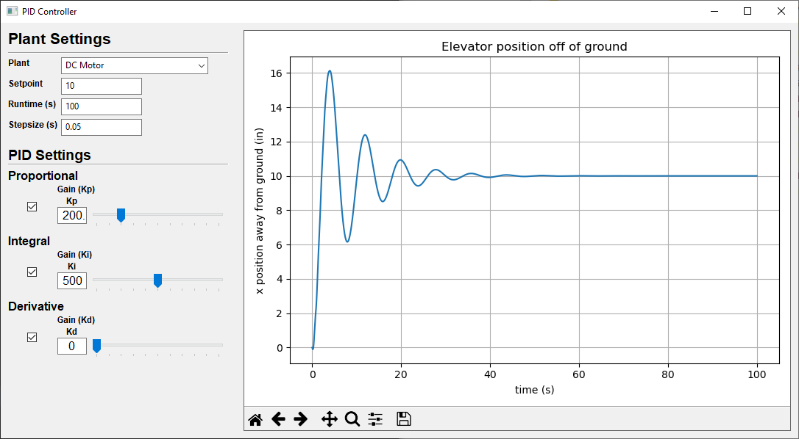

# Table of Contents
1. [Introduction](#introduction)
1. [PID](#pid)
2. [DC Motor Plant](#dc-motor-plant)
3. [Reactor Plant](#reactor-plant)
4. [2nd Order Plant](#2nd-order-plant)

# Introduction

This demonstration explores cavity-modes and mode-locked lasers. The
simulation is of a mode-locked laser where the cavity length, the gain
medium, and the number of modes centered around the central mode
frequency are specified.

# PID

[Talk Math]

# DC Motor Plant

[Talk Math]

# Reactor Plant

[Talk Math]

# 2nd Order Plant

[Talk Math]